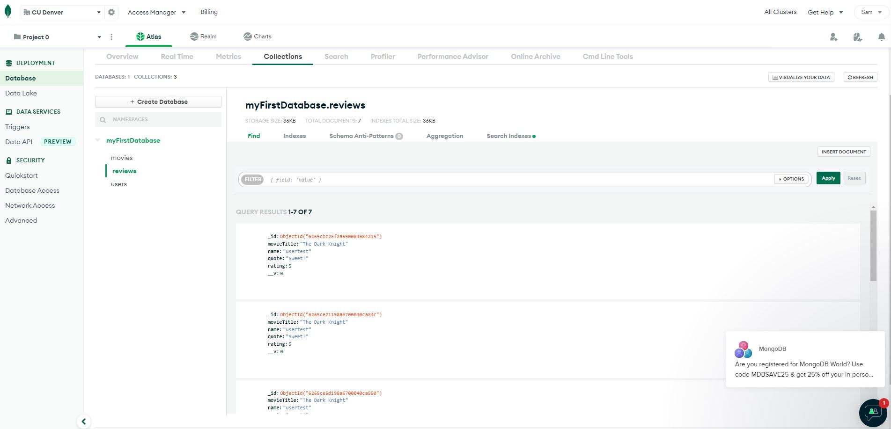

# CSC3916 HW3

## Description:
A standard REST server (POST,GET,PUT,DELETE) using NodeJS/Express.

The React front-end can be found at: https://csc3916-hw5-gryzick.herokuapp.com/#/

The Movies API can be found at: https://csci3916-hw3-gryz.herokuapp.com/

## How-to:
The React website provides UI for the /signup and /signin routes in our web API. The Movies API can be queried using the postman collection included below. Movies can be saved by POSTing to the /movies route. PUT, DEL, and GET are routed under /movies/:id. All CRUD operations are protected by JWT authentication (the token is retrieved from /signin and stored in a .env). Calling a update/save on the /movies collection will perform a validation of the title, year, genre, and an array of three actors in a JSON object.

## POSTMAN:

Check that the environment 'Homework3_gryzick' is enabled in Postman. Postman needs to store 'jwt_token' from the '/signin' POST in an environment variable in order for jwt authentication to succeed.

## MongoDB Atlas:

